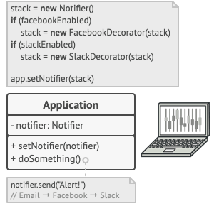

Decorator Pattern:

Trong lập trình, việc mở rộng chức năng của một hệ thống mà không làm rối loạn cấu trúc hiện có là một thách thức đáng kể. Pattern này cho phép chúng ta "trang trí" thêm hành vi (thêm chức năng) cho đối tượng mà không cần thay đổi cấu trúc nội tại của chúng, hỗ trợ mở rộng chức năng mà vẫn tuân thủ nguyên tắc đóng mở (Open/Closed Principle).

Giả dụ ngày xưa ứng dụng của bạn chỉ đáp ứng việc nhận thông báo qua email. bây giờ có 1 số khách hàng có nhu cầu nhận sms hoặc slack. bạn tạo ra 1 đống class dành riêng cho từng khách hàng như dưới. thật là thảm họa.

Thứ nhất: class kế thừa là dạng tĩnh. bạn không thể thay đổi được class này ở chế độ runtime mà phải vào sửa code

Thứ hai: đa số các ngôn ngữ lập trình chỉ hỗ trợ đơn kế thừa. có nghĩa là bạn không thể cho 1 class kế thừa nhiều class khác để có nhiều tính năng.

=> giải pháp, tạo 1 class wrap tất cả các class con, tùy vào cấu hình của người dùng mà kết quả trả về có những thông báo loại nào.

[DecoratorExample](Decorator.md)     

Việc này cũng tương tự như việc mặc quần áo phù hợp ngoài thế giới thật

