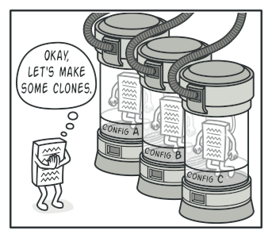
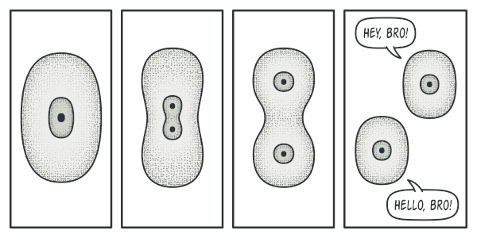

Prototype pattern: tạo ra 1 bản sao của object hiện tại, do việc khởi tạo lại được object đó rất tốn kém hoặc có logic phức tạp, việc clone sẽ nhanh hơn, mong muốn che giấu logic khởi tạo. Nếu làm theo cách thủ công là khởi tạo object, copy các property thì sẽ gặp vấn đề có 1 số property ở trạng thái private không copy được

  
