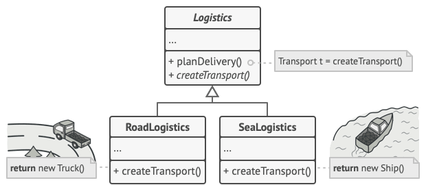
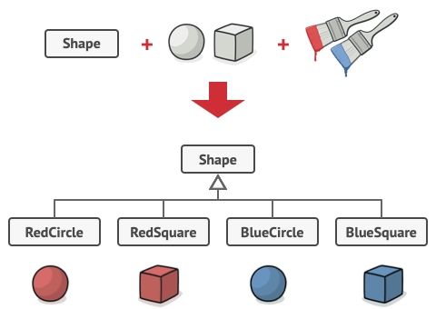

# solution implement các design pattern thường gặp

## Creational Patterns: các pattern hướng tới việc khởi tạo object

Singleton pattern: đảm bảo chỉ tồn tại duy nhất 1 instance trong toàn ứng dụng

Builder pattern: dựng được object mà không cần sử dụng các constructor phức tạp, mỗi 1 object khởi tạo chỉ gọi các hàm cần thiết

   

Factory method pattern: dựng object switch case theo type object truyền vào, mỗi object đều có các hàm chung nhưng xử lý nghiệp vụ đặc thù

 

Abstract factory pattern: dựng ra 1 họ nhiều object có mối liên hệ với nhau, tùy vào điều kiện mà cho ra 1 họ object khác nhau. vd 1 ngôi nhà phong cách quy tộc sẽ có bàn quý tộc, ghế quý tộc, giường quý tốc; 1 ngôi nhà hiện tại sẽ có bàn tối giản, ghế tối giản, giường tối giản,.... Cân nhắc sử dụng khi code có rất nhiều Factory method pattern và có thể có mối liên hệ giữa các factory với nhau

 

Prototype pattern: tạo ra 1 bản sao của object hiện tại, do việc khởi tạo lại được object đó rất tốn kém hoặc có logic phức tạp, việc clone sẽ nhanh hơn, mong muốn che giấu logic khởi tạo. Nếu làm theo cách thủ công là khởi tạo object, copy các property thì sẽ gặp vấn đề có 1 số property ở trạng thái private không copy được

  

## Structural Patterns: hướng tới việc tập hợp đối tượng và lớp thành cấu trúc lớn hơn, trong khi vẫn giữ cho các cấu trúc này linh hoạt và hiệu quả

Adapter pattern: cho phép các đối tượng có interface không tương thích cộng tác với nhau. Được sinh ra để giúp 2 hệ thống không tương thích tương tác với nhau. Theo đúng nguyên tác "để tương thích chứ không phải để sửa đổi". Thay vì cố gắng sửa 2 hệ thống để chạy được, ta tạo ra 1 bộ chuyển đổi (Adapter) để chúng giao tiếp được với nhau.

  

Bridge Pattern: Là một mẫu thiết kế cấu trúc phân chia logic nghiệp vụ hoặc lớp lớn thành các hệ thống phân cấp lớp riêng biệt có thể được phát triển độc lập. ý tưởng chính là sử dụng cầu nối giữa tầng abstraction và tầng implementaion. Ví dụ: chúng ta có 1 đối tượng hình dạng (shape), có 2 class kế thừa là hình tròn và hình vuông (circle và square). Bây giờ chúng ta muốn kế thừa 2 class này để ra được các class có màu sắc là đỏ và xanh. Thì chúng ta phải tạo ra 4 class mới.

=> lỗi thường gặp với việc kế thừa: chúng ta đang cố gắng tạo ra các class kế thừa các class hình dạng (shape class là circle và square bên trên) theo 2 chiều, theo chiều hình dạng (form) và chiều màu sắc (color).

=> sử dụng Bridge Pattern giải quyết vấn đề này bằng cách chuyển từ kế thừa về cách kết hợp. Tạo ra 2 class riêng biệt là class shape ( hình dạng ) và class color ( màu sắc ) rồi tạo 1 class thứ 3 reference tới 2 class kia.

    
