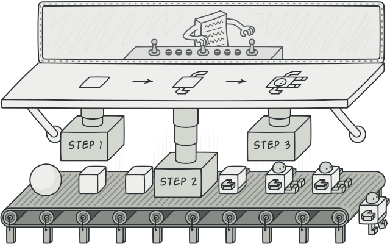

# solution implement các design pattern thường gặp

Singleton pattern: đảm bảo chỉ tồn tại duy nhất 1 instance trong toàn ứng dụng

Builder pattern: dựng được object mà không cần sử dụng các constructor phức tạp, mỗi 1 object khởi tạo chỉ gọi các hàm cần thiết

   

Factory method pattern: dựng object switch case theo type object truyền vào, mỗi object đều có các hàm chung nhưng xử lý nghiệp vụ đặc thù

 

Abstract factory pattern: dựng ra 1 họ nhiều object có mối liên hệ với nhau, tùy vào điều kiện mà cho ra 1 họ object khác nhau. vd 1 ngôi nhà phong cách quy tộc sẽ có bàn quý tộc, ghế quý tộc, giường quý tốc; 1 ngôi nhà hiện tại sẽ có bàn tối giản, ghế tối giản, giường tối giản,.... Cân nhắc sử dụng khi code có rất nhiều Factory method pattern và có thể có mối liên hệ giữa các factory với nhau

 
